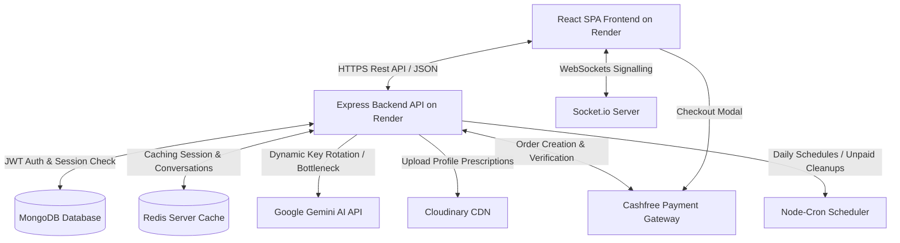

# 🏥 MediCare: Full-Stack AI-Assisted Healthcare & Appointment Booking Platform

MediCare is a state-of-the-art, secure, and highly scalable full-stack healthcare ecosystem. Built on a modern MERN stack framework (**React 18.3, Vite 5.0, Node.js v18+, Express, and MongoDB**), the system streamlines clinical operations, simplifies appointment scheduling, and introduces **MediBot**—an advanced, context-aware AI clinical assistant.

The platform handles secure role-based portals, automated timezone-aware slot management, real-time consultation alerts, and instant WebRTC telemedicine sessions, backed by the **Cashfree** payment gateway.

---

## 🌐 Live Production Deployments

The platform is actively deployed and monitored on Render:
*   **Production Frontend App**: [https://medicare-ai-agent.onrender.com](https://medicare-ai-agent.onrender.com)
*   **Production Backend API Service**: [https://medicare-healthcare-app.onrender.com](https://medicare-healthcare-app.onrender.com)

---

## 🏗️ System Architecture

The following diagram illustrates the structural layout, communication pathways, and external integrations within the MediCare ecosystem:



---

## 🎬 Platform Portals & Visual Previews

### 👤 Patient & AI Agent Experience
*   **Dynamic Landing Page**: Highlights real-time medical statistics, verified clinician counts, and direct triggers for the AI Assistant.
    
*   **Verified Clinician Directory**: Real-time filters for specialties, patient ratings, active availability, and consultation fees in Indian Rupees (`₹`).
    
*   **Secure Multi-Factor Portal**: Dual-layered login supporting standard passwords, secure Google OAuth registration, and verified session tokens.
    
*   **Timezone-Aware Booking**: Guided scheduler showing doctor time slots in Indian Standard Time (IST).
    
*   **MediBot AI Companion**: Persistent chat widget that guides patients through slot bookings and specialized recommendations across pages.
    

### 👨‍⚕️ Clinician Experience
*   **Analytics Dashboard**: Tracking total active consultations, pending requests, patient reviews, and digital wallet earnings.
    
*   **Medication & E-Prescription Drawer**: Generates dynamic templates, clinical recommendations, and registers persistent digital health records.
    

### 🔐 Administration Portal
*   **Administrative Center**: Monitoring total platform users, registration audits, account verifications, and suspension filters.
    
*   **Financial Transaction Ledger**: Interactive payment audits showing cashflow pipelines managed via Cashfree PG.
    

---

## ✨ Core Feature Set

### 1. Patient Portal
*   **Doctor Discovery**: Search specialists by location, fee tier, patient rating, and language.
*   **Dynamic Consultations**: Book slots, reschedule, or sign up for real-time WebRTC audio/video consultations.
*   **Cashfree PG Checkout**: Seamless booking payments with integrated automatic checkout retry flows.
*   **Digital Health Records**: Access prescriptions, diagnostics, and patient history charts.
*   **🤖 24/7 MediBot Assistant**: Context-aware companion built on Google Gemini to assist in:
    *   Answering healthcare questions and providing general preventive care guidance.
    *   Triaging symptoms to recommend the correct medical specialty.
    *   Guiding slot selection and booking appointments directly.
    *   *Disclaimer: MediBot is an AI assistant, not a doctor. For life-threatening emergencies, contact local emergency services immediately.*

### 2. Clinician Dashboard
*   **Availability Planner**: Build weekly/daily schedules with customizable interval grids.
*   **E-Prescription Management**: Generate legal digital prescriptions and share PDF medical history summaries.
*   **Telemedicine Workspace**: High-performance, WebRTC-based video consultation workspace with dual audio/video feeds.
*   **Wallet Analytics**: Review total earnings (with raw conversion to `₹`) and payment verification statuses.

### 3. Central Administration
*   **User Auditing**: Approve, verify, or suspend Doctor profiles and Patient accounts.
*   **Global Telemetry**: Real-time tracking of active socket connections, total consultations, and system cashflow.
*   **Compliance Control**: Central control for platform terms, cookie preferences, and system-wide service variables.

---

## 🛠️ Complete Technical Stack

| Category | Technology | Purpose |
| :--- | :--- | :--- |
| **Frontend** | React 18.3, Vite 5.0 | Dynamic SPA UI and bundle compilation |
| **State & Queries** | Redux Toolkit, React Query (TanStack) | Global state slice syncing and async caching |
| **Styling & Theme**| Tailwind CSS, HSL Tokens, Glassmorphism | Responsive layout, modern UI cards, dark/light theme |
| **Backend Framework**| Node.js v18+, Express.js | Core API engine, middleware pipelines |
| **Database** | MongoDB & Mongoose ODM | Relational schemas, indexing, soft deletions |
| **Caching Cache** | Redis Server Client | Agent session persistence and API throttle metrics |
| **Payments** | Cashfree-js SDK / cashfree-pg | Order generation, redirection, secure confirmation |
| **Generative AI** | Google Generative AI (Gemini) | MediBot clinical agent and recommendation engine |
| **Real-time Engine** | Socket.io / Socket.io Client | Instant notifications and WebRTC consultation rooms |
| **Monitoring** | Sentry SDK (Browser/Node), Winston | Crash tracking, distributed client logs, rotating logs |

---

## 📂 Project Structure

```bash
doctor-appointment-project/
├── Backend/                       # Express.js REST API & Websocket Server
│   ├── src/
│   │   ├── app.js                 # Middleware pipelines & API mount points
│   │   ├── index.js               # Entry point (DB connection & boot)
│   │   ├── socket.js              # Socket.io setup & WebRTC signaling logic
│   │   ├── config/                # Redis, Cloudinary, and Swagger configs
│   │   ├── controllers/           # HTTP Request/Response controllers
│   │   ├── db/                    # MongoDB connection drivers
│   │   ├── jobs/                  # node-cron automated server routines
│   │   ├── middlewares/           # JWT, role checks, and error filters
│   │   ├── models/                # Mongoose database models
│   │   ├── routes/                # Express routing files (v1 API)
│   │   ├── services/              # Cashfree, Mail, and Gemini service layers
│   │   ├── utils/                 # Winston logging, API errors, wrappers
│   │   └── validators/            # Zod validation schema files
│   ├── Dockerfile                 # Production environment container config
│   ├── ecosystem.config.cjs       # PM2 process configuration
│   └── package.json               # Backend dependencies
│
└── frontend/                      # React SPA Client (Vite 5.0 compilation)
    ├── src/
    │   ├── assets/                # Global styling, vectors, and icons
    │   ├── components/            # Reusable UI elements & layout skeletons
    │   ├── context/               # Dark Theme and Socket connections
    │   ├── features/              # Redux slices (auth, appointments, agent)
    │   ├── hooks/                 # Custom react hooks (auth validation, debounce)
    │   ├── pannel/                # Role-specific workspaces (Patient, Doctor, Admin)
    │   ├── services/              # Axios custom client & Cashfree loaders
    │   ├── store/                 # Redux Toolkit store config
    │   ├── utils/                 # Date formatters & input validators
    │   ├── App.jsx                # Layout switcher matching user roles
    │   └── main.jsx               # App mounting, routing, and Sentry hooks
    ├── public/                    # Service worker, static icons, PWA assets
    ├── sw.js                      # Service worker for offline capability
    ├── vite.config.js             # Vite configuration with server proxies
    ├── tailwind.config.js         # Custom Tailwind variables and utilities
    └── package.json               # Frontend dependencies
```

---

## 🚀 Local Installation & Setup

### Prerequisites
*   **Node.js**: `v18.0.0` or higher
*   **MongoDB**: Local server instance or active MongoDB Atlas cluster
*   **Redis**: Local Redis instance (`localhost:6379`) or active Redis URL

### Step 1: Clone the Repository
```bash
git clone https://github.com/Rajmishra-2125/doctor-appointment-project.git
cd doctor-appointment-project/doctor-appointment-project
```

### Step 2: Configure and Launch the Backend
1.  Navigate to the directory and install dependencies:
    ```bash
    cd Backend
    npm install
    ```
2.  Create your local configuration variables:
    ```bash
    cp .env.sample .env
    ```
3.  Configure your environment parameters (see [Backend ENV Configuration](#backend-env)).
4.  Run in Development mode:
    ```bash
    npm run dev
    ```
    *The API will mount and serve endpoints at `http://localhost:8000/api/v1`.*

### Step 3: Configure and Launch the Frontend
1.  Open a new terminal window, navigate to the frontend directory, and install dependencies:
    ```bash
    cd frontend
    npm install
    ```
2.  Set up client variables:
    ```bash
    cp .env.example .env
    ```
3.  Configure your local keys (see [Frontend ENV Configuration](#frontend-env)).
4.  Launch the Vite development server:
    ```bash
    npm run dev
    ```
    *The UI will launch in hot-reloading mode at `http://localhost:5173`.*

---

## 📋 Complete Environment Configuration

### Backend ENV
Copy the keys below into `Backend/.env` and replace placeholders with your credentials:

```ini
# Core Server Configuration
PORT=8000
HOST=0.0.0.0
NODE_ENV=development
CORS_ORIGIN=http://localhost:5173

# Databases
MONGODB_URI=mongodb://127.0.0.1:27017/medicare
REDIS_URL=redis://127.0.0.1:6379

# JWT Tokens
ACCESS_TOKEN_SECRET=your_jwt_access_secret_key_string
ACCESS_TOKEN_EXPIRY=1d
REFRESH_TOKEN_SECRET=your_jwt_refresh_secret_key_string
REFRESH_TOKEN_EXPIRY=10d

# Mail Settings (SMTP)
MAIL_HOST=smtp.gmail.com
MAIL_PORT=587
MAIL_USER=your_email@gmail.com
MAIL_PASS=your_gmail_app_password

# CDN (Cloudinary)
CLOUDINARY_CLOUD_NAME=your_cloud_name
CLOUDINARY_API_KEY=your_api_key
CLOUDINARY_API_SECRET=your_api_secret

# Cashfree PG Integration
CASHFREE_APP_ID=your_cashfree_app_id
CASHFREE_SECRET_KEY=your_cashfree_secret_key
CASHFREE_ENVIRONMENT=SANDBOX

# Google OAuth Setup
GOOGLE_CLIENT_ID=your_google_client_id
GOOGLE_CLIENT_SECRET=your_google_client_secret

# AI Agent Integration (Supports Multi-Key Rotation)
GEMINI_API_KEYS=key1,key2,key3
GEMINI_MODEL=gemini-2.5-flash

# Logging & Monitoring
SENTRY_DSN=your_sentry_backend_dsn
RENDER_EXTERNAL_URL=http://localhost:8000
```

### Frontend ENV
Copy the keys below into `frontend/.env`:

```env
# API Connectivity
VITE_API_URL=http://localhost:8000/api/v1
VITE_SOCKET_URL=http://localhost:8000

# Authentication & Analytics
VITE_GOOGLE_CLIENT_ID=your_google_client_id
VITE_SENTRY_DSN=your_sentry_frontend_dsn

# CDN Configurations
VITE_CLOUDINARY_CLOUD_NAME=your_cloud_name
VITE_CLOUDINARY_UPLOAD_PRESET=your_preset
```

---

## 🔒 Security & Performance Features

*   **Robust CSRF & CORS**: Restricts access explicitly to verified whitelist origins, blocking external injection attempts.
*   **State-of-the-Art Authentication**: SameSite, Secure HttpOnly JWT cookies combined with dynamic local fallback headers to bypass third-party browser cookie restrictions.
*   **Database Soft Deletes**: Inactive accounts are soft-deleted and scheduled for purge via background cron routines after 30 days.
*   **AI Rate-Limiting**: Integrated token bucket limiters to regulate downstream API calls to Google's GenAI services.
*   **DDoS Protection**: Express Rate Limit configuration restricting IP bursts on core APIs and auth pathways.
*   **PWA Cache Strategies**: Offline-ready configurations caching core pages and assets using a progressive service worker (`sw.js`).
*   **Distributed Error Tracking**: End-to-end Sentry reporting in both React UI elements and Node pipelines.

---

## 🙋 Support & License

*   **Main Developer**: Raj Mishra
*   **License**: Licensed under the MIT License terms.
